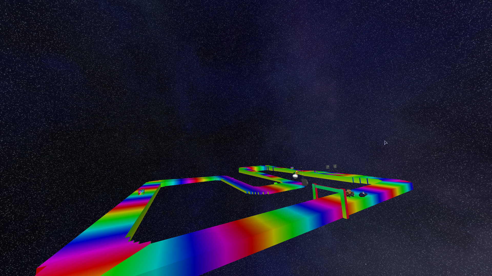

# Practical of computer graphics

This project was developed as part of a computer graphics practical. The
objective was to implement a custom 3D engine capable of rendering a small
animated movie while satisfying several constraints:

- Having keyframed animations 🏎️
- Having a physical animation 💣
- Containing several light sources 💡
- Models must have textures and materials 🎨
- Show a story containing a turtle 🐢

## Screenshots




## Technologies

- Language: C++
- [OpenGL](https://www.opengl.org/)
- [SFML](https://www.sfml-dev.org/fr/)

## Running the project

To build and run the project:

```sh
cd sampleProject
./run.sh final_project ccr
```

## Credits

- Bowser model: <https://models.spriters-resource.com/ds_dsi/nintendogs/asset/291397/>

#### Bowser

[Bowser (Mario Kart 8 Deluxe)](https://skfb.ly/pqwKD)
by [Austin Zimmermann](https://sketchfab.com/AustinZimmermann)
licensed under the
[Creative Commons - Attribution](https://creativecommons.org/licenses/by/4.0/)
Modified and separate to `.obj` format.

#### Lakitu

[Mario Sports Mix Lakitu](https://skfb.ly/pCJCo)
by [RedYoshiDedepants](https://sketchfab.com/jdedepants)
licensed under the
[Creative Commons - Attribution](https://creativecommons.org/licenses/by/4.0/)
Modified and separate to `.obj` format.

#### road galleon

[road galleon](https://sketchfab.com/3d-models/road-galleon-cc629003a2dd41a99b6d0197d2857950)
by [amogusstrikesback2](https://sketchfab.com/amogusstrikesback2)
is licensed under
[Creative Commons - Attribution](http://creativecommons.org/licenses/by/4.0/).

Modified to `.obj` format.

#### Bob-Omb

[Bob-Omb](https://skfb.ly/pvNxH)
by [jkimme1694](https://sketchfab.com/jkimmel694)
is licensed under
[Creative Commons - Attribution](http://creativecommons.org/licenses/by/4.0/).

Modified to `.obj` format.

#### Green Red Shell

[Green Red Shell](https://skfb.ly/ptSIV)
by [Polygonal_64](https://sketchfab.com/LegoshiFan)
is licensed under
[Creative Commons - Attribution](http://creativecommons.org/licenses/by/4.0/).

Modified to `.obj` format.

#### Lightning

[Lightning](https://skfb.ly/pvNxS)
by [jkimme1694](https://sketchfab.com/jkimmel694)
is licensed under
[Creative Commons - Attribution](http://creativecommons.org/licenses/by/4.0/).

Modified to `.obj` format.

#### Mushroom

[Mushroom](https://skfb.ly/pw6sC)
by [jkimme1694](https://sketchfab.com/jkimmel694)
is licensed under
[Creative Commons - Attribution](http://creativecommons.org/licenses/by/4.0/).

Modified to `.obj` format.

#### Penguin

[Penguin](https://skfb.ly/pwpN8)
by [jkimme1694](https://sketchfab.com/jkimmel694)
is licensed under
[Creative Commons - Attribution](http://creativecommons.org/licenses/by/4.0/).

Modified to `.obj` format.

#### Pianta

[Pianta](https://skfb.ly/pBwyp)
by [Polygonal_64](https://sketchfab.com/LegoshiFan)
is licensed under
[Creative Commons - Attribution](http://creativecommons.org/licenses/by/4.0/).

Modified to `.obj` format.

#### Blue Shell

[Blue Shell](https://skfb.ly/ptSHW)
by [Polygonal_64](https://sketchfab.com/LegoshiFan)
is licensed under
[Creative Commons - Attribution](http://creativecommons.org/licenses/by/4.0/).

Modified to `.obj` format.

#### Star

[Star](https://skfb.ly/pw6sp)
by [jkimme1694](https://sketchfab.com/jkimmel694)
is licensed under
[Creative Commons - Attribution](http://creativecommons.org/licenses/by/4.0/).

Modified to `.obj` format.

#### Thwomp

[Thwomp](https://skfb.ly/pso8C)
by [Polygonal_64](https://sketchfab.com/LegoshiFan)
is licensed under
[Creative Commons - Attribution](http://creativecommons.org/licenses/by/4.0/).

Modified to `.obj` format.

#### Star Trophy

[Star Trophy](https://skfb.ly/p8oq6)
by [Polygonal_64](https://sketchfab.com/LegoshiFan)
is licensed under
[Creative Commons - Attribution](http://creativecommons.org/licenses/by/4.0/).

Modified to `.obj` format.

#### SNES Rainbow Road (with resemblance to MK8 Retro Course)

[SNES Rainbow Road (with resemblance to MK8 Retro Course)](https://www.thingiverse.com/thing:606403)
by [dougwinning99](https://www.thingiverse.com/dougwinning99/designs)
licensed under the
[Creative Commons - Attribution - Share](https://creativecommons.org/licenses/by-sa/3.0/)
Alike license.

Modified to `.obj` format.

#### Steel Driver

[Steel Driver](https://sketchfab.com/3d-models/steel-driver-7b4f330f1af2420fbf1598e1ed8c9e98)
by [Polygonal_64](https://sketchfab.com/LegoshiFan)
licensed under the
[Creative Commons - Attribution - Share](https://creativecommons.org/licenses/by-sa/3.0/)
Alike license.

Modified to `.obj` format.

#### Steel Driver

[Steel Driver](https://sketchfab.com/3d-models/steel-driver-7b4f330f1af2420fbf1598e1ed8c9e98)
by [Polygonal_64](https://sketchfab.com/LegoshiFan)
licensed under the
[Creative Commons - Attribution - Share](https://creativecommons.org/licenses/by-sa/3.0/)
Alike license.

Modified to `.obj` format.

#### Mario Kart Item Box

[Mario Kart Item Box](https://sketchfab.com/3d-models/mario-kart-item-box-8f6a2b6b17b844c5b5dfa38375289975)
by [Bscott5](https://sketchfab.com/Bscott5)
licensed under the
[Creative Commons - Attribution - Share](https://creativecommons.org/licenses/by-sa/3.0/)
Alike license.

Modified to `.obj` format.

#### Bullet Bill

[Bullet Bill](https://sketchfab.com/3d-models/bullet-bill-475c69f78be84bfc823560c22a187efd)
by [Polygonal_64](https://sketchfab.com/LegoshiFan)
licensed under the
[Creative Commons - Attribution - Share](https://creativecommons.org/licenses/by-sa/3.0/)
Alike license.

Modified to `.obj` format.
